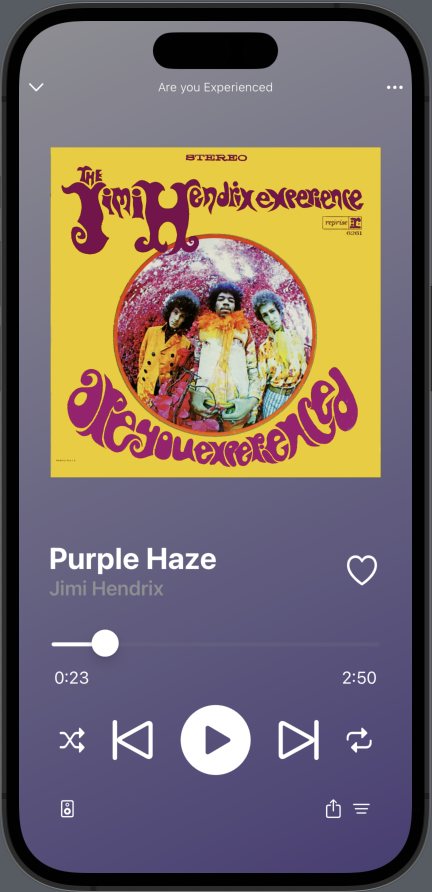
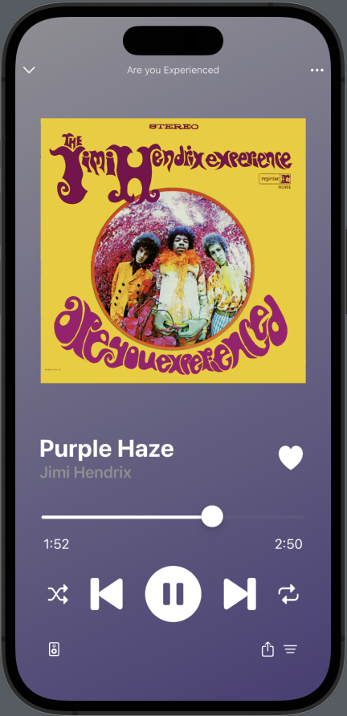

# Spotify UI Remake

  

For this project I recreated the spotify music player UI with one of my favorite songs, Purple Haze by Jimi Hendrix. In building this, I became more comfortable working with Zstacks, Hstacks, and Vstacks in SwiftUI and gained experience using various other views and modifiers.

  

Several of the buttons in this UI remake change when clicked! the like button, play button, and the next song / previous song buttons all change on click. In addition to this, the current play time changes when the slider is dragged to a new position.
